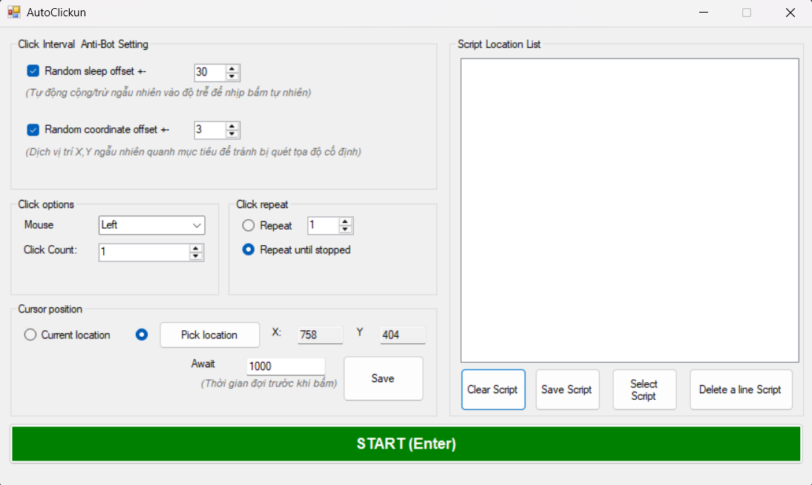

# AutoClickun

**AutoClickun** là công cụ tự động click chuột, hỗ trợ lập kịch bản nhiều điểm click với độ trễ tùy chỉnh cho từng bước. Phù hợp để tự động hóa các tác vụ lặp đi lặp lại trên màn hình.

---

## Giao diện

  

---

## Tính năng

- **Lập kịch bản nhiều điểm click** — thêm nhiều vị trí click, mỗi vị trí có độ trễ riêng
- **Pick Location** — chọn tọa độ trực tiếp bằng cách click lên màn hình, không cần nhập tay
- **Await (ms) per action** — mỗi bước có thể đặt thời gian chờ khác nhau (ví dụ: bước 1 chờ 2 giây, bước 2 chờ 3 phút)
- **Lưu / Load kịch bản** — lưu script ra file `.acs`, load lại dùng tiếp mà không cần thiết lập lại
- **Anti-bot offset tọa độ** — thêm sai số ngẫu nhiên vào tọa độ click để tránh bị phát hiện
- **Anti-bot offset sleep** — thêm sai số ngẫu nhiên vào thời gian chờ
- **Lặp vô hạn hoặc N lần** — chạy kịch bản theo số lần tùy chọn hoặc cho đến khi dừng

---

## Yêu cầu hệ thống

| Thành phần     | Yêu cầu                                   |
| -------------- | ----------------------------------------- |
| Hệ điều hành   | Windows 7 / 8 / 10 / 11                   |
| .NET Framework | 4.7.2 trở lên (có sẵn trên Windows 10/11) |
| Kiến trúc      | x86 / x64                                 |

---

## Cách dùng

### 1. Tải và chạy

Tải file `AutoClickun.exe` từ trang Releases rồi double-click để chạy. Không cần cài đặt.

---

### 2. Tạo kịch bản click

1. Bấm **Pick location** → form thu nhỏ, click vào vị trí muốn click trên màn hình
2. Nhập thời gian chờ vào ô **Await (ms)** — ví dụ `2000` = chờ 2 giây sau khi click
3. Bấm **Save** để thêm action vào danh sách
4. Lặp lại để thêm nhiều điểm

```
Ví dụ kịch bản:
  📍 (500, 300) ← click vị trí A
  ⏳ 2000ms ← chờ 2 giây   
  📍 (800, 450) ← click vị trí B
  ⏳ 180000ms ← chờ 3 phút
```

---

### 3. Cấu hình nâng cao

| Tùy chọn                 | Mô tả                                         |
| ------------------------ | --------------------------------------------- |
| **Repeat N times**       | Chạy kịch bản đúng N lần rồi dừng             |
| **Repeat until stopped** | Chạy vô hạn cho đến khi bấm STOP              |
| **Random offset XY**     | Lệch tọa độ ngẫu nhiên ±X pixel mỗi lần click |
| **Random offset Sleep**  | Lệch thời gian chờ ngẫu nhiên ±X ms           |

---

### 4. Lưu và load kịch bản

**Lưu kịch bản:**

- Bấm **Save Script** → chọn nơi lưu → file `.acs` được tạo

**Load kịch bản:**

- Bấm **Load Script** → chọn file `.acs`
- Nếu danh sách đang có dữ liệu, chọn **Ghi đè** hoặc **Thêm vào cuối**

File `.acs` là JSON thuần, có thể mở bằng Notepad để xem hoặc sửa tay:

json

```json
[
  { "X": 500, "Y": 300, "DelayMs": 2000 },
  { "X": 800, "Y": 450, "DelayMs": 180000 }
]
```

---

### 5. Chạy và dừng

- Bấm **START (Enter)** hoặc nhấn phím `Enter` để bắt đầu
- Bấm **STOP (Enter)** hoặc nhấn phím `Enter` để dừng ngay lập tức

---

## Cấu trúc project

```
AutoClickun/
├── Models/
│   └── ClickAction.cs          # Data model: tọa độ + delay
├── Services/
│   ├── ClickExcutor.cs         # Async execution engine
│   └── Win32Api.cs             # P/Invoke: mouse_event, GetAsyncKeyState
├── AutoClickun.cs              # Form code-behind (UI logic)
├── AutoClickun.Designer.cs     # Designer-generated layout
└── Program.cs                  # Entry point
```

---

## License

MIT License — tự do sử dụng, chỉnh sửa và phân phối.
